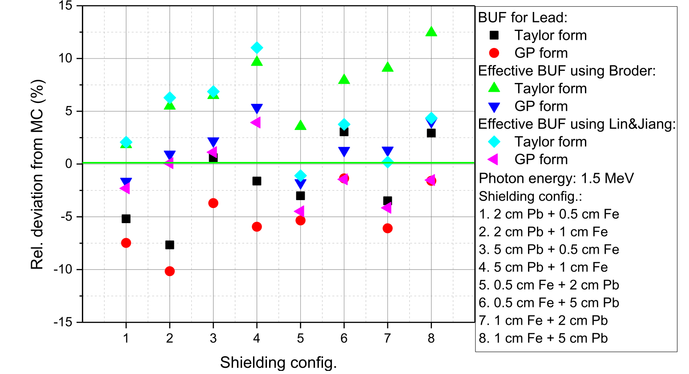

# XSformer

by *[Shuo Xu](https://www.researchgate.net/profile/Shuo-Xu-21).
****
🔔 This is the code of a X-ray Build-Up Factor Calculating Method for Multilayer Shields

🔔 We proposed a network based on [Transformer](https://arxiv.org/abs/1706.03762)
****

## background
Traditional method (empirical formula) to calculate Build-Up factor has large deviation

</td>
## Dataset
Te Monte Carlo method is uesd to generate dataset with different energy, different shield thickness, and different shield material combinations. 
Establishing concentric sphere model to improve simulation efficiency.

<table frame=void>
	<tr>		  
    <td>

</td>	
    <td>

</td>	                     
    <td>

</td>
                     
  </tr>
</table>

## Network architecture
use Transformer as backbone.

