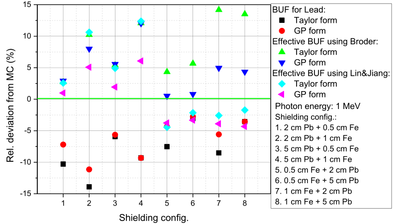
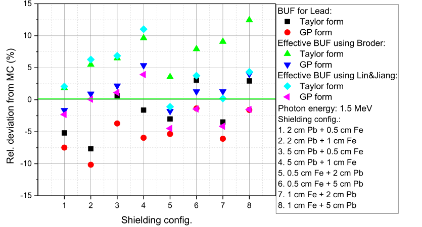
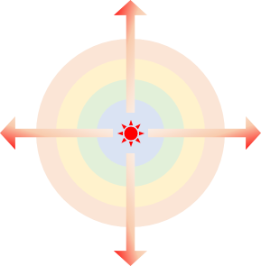
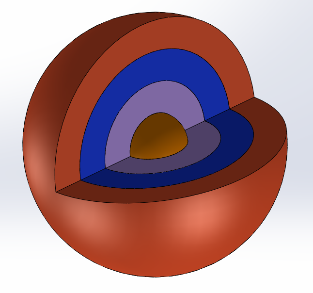
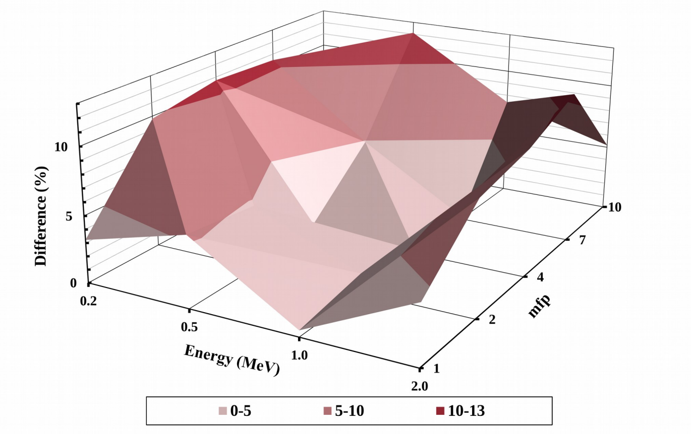
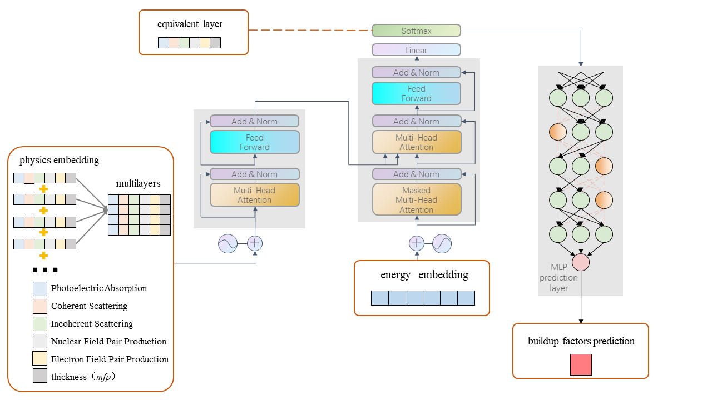

# XSformer

by *[Shuo Xu](https://www.researchgate.net/profile/Shuo-Xu-21).
****
🔔 This is the code of a X-ray Build-Up Factor Calculating Method for Multilayer Shields

🔔 We proposed a network based on [Transformer](https://arxiv.org/abs/1706.03762)
****

## background
Traditional method (empirical formula) to calculate Build-Up factor has large deviation.
<table frame=void>
	<tr>		  
    <td width="50%">

</td>	
    <td width="50%">

</td>	                     
                     
  </tr>
</table>
		  
## Dataset
The Monte Carlo method is uesd to generate dataset with different energy, different shield thickness, and different shield material combinations. 
Establishing concentric sphere model to improve simulation efficiency.

<table frame=void>
	<tr>		  
    <td width="28%">

</td>	
    <td width="28%">

</td>	                     
    <td width="44%">

</td>
                     
  </tr>
</table>

## Network architecture
We use Transformer as backbone. The embedding layer and output is replaced according to the downstream task.
We innovatively proposed a physics embedding method and designed anequivalent physical layer.

## Acknowledgments
We would like to acknowledge [Hugging Face community](https://huggingface.co/) for their [pytorch implementation of Transformer](https://github.com/huggingface/pytorch-openai-transformer-lm), which gaves me some inspiration in modeling, although we didn't directly carry their code.

<!--We also would like to acknowledge [Zhizhen zhang](https://github.com/MaoXvan) for their [matlab implementation of NIST Dataset](https://github.com/MaoXvan/X-ray-Attenuation-Calculator)>

&nbsp;
 

  <b><i>
  Copyright &#x00A9; 2022 ShuoXu. 
  </i></b>

